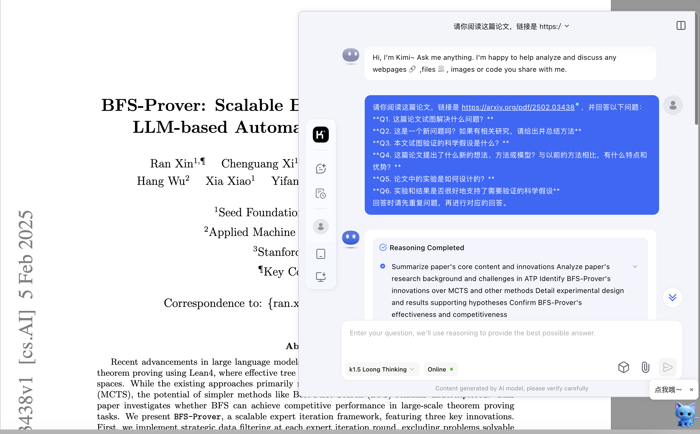

# Kimi-paper

**Kimi-paper** 是一款专为学术研究人员设计的浏览器扩展工具，旨在帮助用户快速分析 PDF 论文内容。通过与 Kimi AI 的集成，用户可以轻松获取论文的核心问题、研究方法、科学假设等关键信息，提升阅读和研究效率。

---

## 项目特点

1. **PDF 论文分析**：
   - 自动识别当前页面的 PDF 论文链接，生成 AI 分析结果。
   - 提供论文的核心问题、研究方法、科学假设等关键信息。

2. **悬浮窗交互**：
   - 点击 Cat 图标后，显示悬浮窗，加载 AI 分析结果。
   - 悬浮窗大小根据窗口动态调整，提供最佳阅读体验。

3. **用户友好**：
   - 界面简洁，操作直观，适合学术研究人员使用。
   - 仅在 PDF 页面中显示 Cat 图标，不影响其他网页浏览体验。

---

## 安装与使用

### 方法一：通过 Google 浏览器加载扩展

1. **下载项目代码**：
   - 将项目代码下载到本地，解压缩。

2. **打开 Chrome 扩展管理页面**：
   - 在 Google 浏览器地址栏输入 `chrome://extensions/`，按回车键。

3. **启用开发者模式**：
   - 在扩展管理页面右上角，打开“开发者模式”开关。

4. **加载扩展**：
   - 点击“加载已解压的扩展程序”按钮，选择项目代码所在的文件夹。

5. **开始使用**：
   - 打开任意 PDF 论文页面，点击页面右下角的 Cat 图标，即可使用 Kimi-paper 分析论文。

---

### 方法二：通过 CRX 文件安装

1. **下载 CRX 文件**：
   - 从项目发布页面下载生成的 `.crx` 文件。

2. **打开 Chrome 扩展管理页面**：
   - 在 Google 浏览器地址栏输入 `chrome://extensions/`，按回车键。

3. **安装 CRX 文件**：
   - 将下载的 `.crx` 文件拖拽到扩展管理页面中，按照提示完成安装。

4. **开始使用**：
   - 打开任意 PDF 论文页面，点击页面右下角的 Cat 图标，即可使用 Kimi-paper 分析论文。

---

## Acknowledge

- 项目使用DeepSeek-V3辅助开发
- README同样右DeepSeek-V3模型生成
- 项目图标由豆包大模型生成
- 感谢Kimi模型支持

